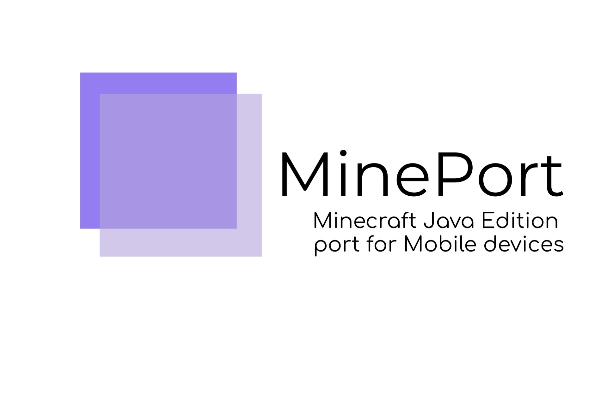
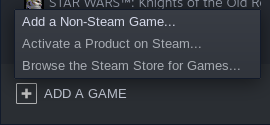
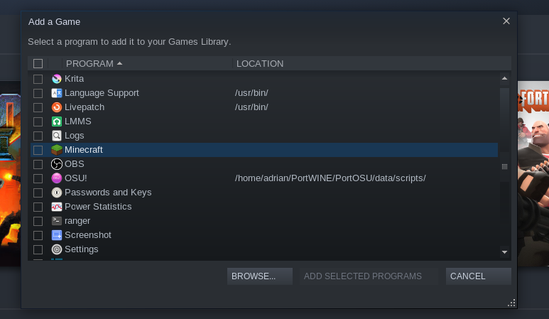

# Navigation

1. [Install](https://github.com/MinePort-Dev/MinePort-linux#install)
2. [Preparing for the game](https://github.com/MinePort-Dev/MinePort-linux#preparing-for-the-game)
3. [What versions does the program run on?](https://github.com/MinePort-Dev/MinePort-linux#what-versions-does-the-program-run-on)
4. [How to update?](https://github.com/MinePort-Dev/MinePort-linux#how-to-update)
5. [Any more questions?](https://github.com/MinePort-Dev/MinePort-linux#Support)

# Install
Install the repository via git:
```bash
$ git clone https://github.com/MinePort-Dev/MinePort-Installer.git
```
or via ZIP

Next, put the Miniport folder in the folder ./minecraft

### ATTENTION THIS IS IMPORTANT: First, throw the repository in the folder with minecraft, and only then add minecraft to the Steam library

# Preparing for the game
## 1. PC

You will need to install the Steam(do not be surprised, minecraft did not appear in the steam). We will need it for the new cloud gaming technology "Steam Remote Play"
Then go to your library and click on the "Add game" button in the lower left corner and select "Add a Non-Steam game" in the menu that appears"

Add install this -> [XConfig-9](https://www.youtube.com/watch?v=dQw4w9WgXcQ)



Then, in the window that opens, we look for minecraft and add to your Steam-library




## Mobile device

And there are no settings on your mobile device, you just need to install the official app from Valve-Steam Link([IOS](https://apps.apple.com/us/app/steam-link/id1246969117)/[Android](https://play.google.com/store/apps/details?id=com.valvesoftware.steamlink)/[RasberryPi](https://steamcommunity.com/app/353380/discussions/6/2806204039992195182/))

Launch the SteamLink app and follow all the instructions in It(to link accounts) Then (right in the app) go to your game library and choose Minecraft there.

Go to settings and change the control to the one that will be convenient for you!


### You don't have to configure it the way you see it on the GIF! This is my layout and I'm comfortable with it, you can assign buttons as you like, it doesn't matter!

# What versions does the program run on?

From 1.12 to 1.16.2

# How to update?

Be sure to install git -> [Download](https://git-scm.com/)

```$ sh updater.sh```

# # Support

<div>
  <a target="_blank" href="https://discord.gg/7xrxJta" title="Join our Discord!">
    
  </a>
</div>
